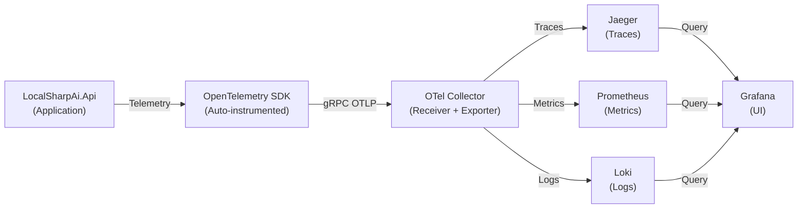

# OpenTelemetry Observability Stack

Complete observability solution for LocalSharpAI using industry-standard components.

## Stack Components

| Component | Purpose | Port | URL |
|-----------|---------|------|-----|
| **OTel Collector** | Receives and processes telemetry | 4317 (gRPC), 4318 (HTTP) | N/A |
| **Jaeger** | Distributed tracing backend | 16686 | http://localhost:16686 |
| **Prometheus** | Metrics time-series database | 9090 | http://localhost:9090 |
| **Loki** | Log aggregation | 3100 | http://localhost:3100 (API only, no web UI) |
| **Grafana** | Unified visualization | 3000 | http://localhost:3000 |

## Quick Start

### Prerequisites
- Docker & Docker Compose
- .NET 10 SDK
- 2GB free RAM
- 2GB free disk space

### Start Stack (30 seconds)

```bash
# Navigate to observability directory
cd observability

# Start all services
docker-compose up -d

# Verify all services are running and healthy
docker-compose ps
```

All services should show `Up X minutes (healthy)` status.

### Access UIs

```
Grafana:      http://localhost:3000    (admin / admin)
Jaeger:       http://localhost:16686
Prometheus:   http://localhost:9090
Loki:         http://localhost:3100    (API only, use Grafana UI)
```

### Stop Stack

```bash
docker-compose down
```

## Files Overview

```
observability/
├── docker-compose.yml                    # Main stack configuration
├── SETUP.md                              # Detailed setup guide
├── ROADMAP.md                            # Integration roadmap
│
├── otel-collector/
│   └── otel-collector-config.yml         # OTel Collector configuration
│       ├── Receivers (OTLP, Prometheus, Jaeger)
│       ├── Processors (batch, memory_limiter, sampling)
│       └── Exporters (Jaeger, Prometheus, Loki)
│
├── prometheus/
│   ├── prometheus.yml                    # Prometheus scrape config
│   └── alert_rules.yml                   # Alert rules for monitoring
│
├── loki/
│   └── loki-config.yml                   # Loki log ingestion config
│
└── grafana/
    ├── provisioning/
    │   ├── datasources.yml               # Auto-configure data sources
    │   └── dashboards.yml                # Dashboard provisioning
    └── dashboards/
        ├── api-performance.json          # API latency & error rates
        ├── logs.json                     # Log aggregation dashboard
        └── traces.json                   # Trace analysis dashboard
```

## Key Features

### 🔍 Distributed Tracing (Jaeger)
- Full request tracing from entry point
- Service dependency map
- Latency analysis
- Error tracking

**Trace Details**:
- HTTP requests/responses
- Database queries
- Agent executions
- Model operations
- Tool invocations

### 📊 Metrics (Prometheus)
- Request latency (p50, p95, p99)
- Throughput (requests/sec)
- Error rates by status code
- Agent execution metrics
- Model performance metrics
- System resources (CPU, memory, GC)

**Available Metrics**:
- `http_request_duration_seconds` - Request latency histogram
- `http_requests_total` - Total request count
- `agent_execution_duration_seconds` - Agent execution time
- `agent_execution_total` - Agent execution count
- `model_load_duration_seconds` - Model load time
- `inference_duration_seconds` - Model inference time

### 📝 Log Aggregation (Loki)
- Real-time log streaming
- Label-based filtering
- LogQL query language
- Log correlation with traces
- Error log isolation

**Log Features**:
- Structured logging
- Multiple log levels
- Correlation IDs
- JSON parsing

### 📈 Dashboards (Grafana)
**Pre-configured Dashboards**:
1. **API Performance** - Latency, throughput, errors
2. **Logs** - Real-time log viewer with filtering
3. **Traces** - Trace search and analysis

## Configuration

### Application Setup

See [SETUP.md](./SETUP.md) for complete integration guide including:
- NuGet package installation
- Program.cs configuration
- Environment variables
- Verification steps

### Environment Variables

```bash
# OTel SDK configuration
OTEL_EXPORTER_OTLP_ENDPOINT=http://localhost:4317
OTEL_EXPORTER_OTLP_PROTOCOL=grpc
OTEL_SERVICE_NAME=LocalSharpAi.Api
OTEL_SERVICE_VERSION=1.0.0
OTEL_DEPLOYMENT_ENVIRONMENT=development

# Sampling (0.0 - 1.0, default 1.0 = 100%)
OTEL_TRACES_SAMPLER=parentbased_always_on
OTEL_TRACES_SAMPLER_ARG=0.1

# Prometheus metrics endpoint
DOTNET_METRICS_ENABLED=true
```

## Production Deployment

See [observability-azure-deployment.md](../docs/observability-azure-deployment.md) for:
- Azure Application Insights
- Azure Log Analytics
- Azure Managed Prometheus
- Azure Managed Grafana
- Cost optimization strategies

## Troubleshooting

### No telemetry in Jaeger
1. Check `OTEL_EXPORTER_OTLP_ENDPOINT` is set to `http://localhost:4317`
2. Verify collector is running: `docker logs otel-collector`
3. Check logs for exporter initialization errors

### Metrics not in Prometheus
1. Verify `/metrics` endpoint exists: `curl http://localhost:5000/metrics`
2. Check Prometheus targets: http://localhost:9090/targets
3. Verify scrape interval hasn't passed: 15s default

### Logs missing from Loki
1. Verify OTel logging is configured in Program.cs
2. Check Loki is healthy: `curl http://localhost:3100/ready`
3. Verify correct log level is set

### High memory usage
1. Reduce batch size in `otel-collector-config.yml`
2. Lower sampling rate (e.g., 0.1 for 10%)
3. Reduce log retention in `loki-config.yml`

See [SETUP.md](./SETUP.md#troubleshooting) for detailed troubleshooting guide.

## Performance Tuning

### Sampling Rates
Lower sampling in production to reduce data volume:
```
Development: 1.0 (100%)
Staging: 0.5 (50%)
Production: 0.1 (10%)
```

### Batch Processor
Adjust batch settings for throughput vs latency:
```
Low latency:  send_batch_size=256, timeout=5s
High throughput: send_batch_size=1024, timeout=10s
```

### Data Retention
Configure based on storage capacity:
```
Prometheus: 15 days
Loki: 7 days
Jaeger: 72 hours
```

## Data Privacy

⚠️ **Important**: The local observability stack:
- Runs entirely on your machine
- Does not send data externally
- Stores data locally in Docker volumes
- Suitable for development and testing
- NOT suitable for storing sensitive data in production

For production with sensitive data, use Azure Monitor with encryption.

## Architecture



## Common Use Cases

### Debug Slow API Request
1. Open Jaeger (http://localhost:16686)
2. Select service: LocalSharpAi.Api
3. Search for slow requests (filter by duration)
4. Analyze span details

### Investigate Error Spike
1. Open Prometheus (http://localhost:9090)
2. Query: `rate(http_requests_total{status=~"5.."}[5m])`
3. Note time of spike
4. Check Loki for error logs at that time
5. Use Jaeger to find failed traces

### Monitor Agent Execution
1. Open Grafana (http://localhost:3000)
2. Create custom dashboard querying:
   - `agent_execution_duration_seconds`
   - `agent_execution_total`
3. Set alerts on high failure rates

### Track Model Performance
1. Prometheus queries:
   - `histogram_quantile(0.99, inference_duration_seconds_bucket)`
   - `rate(model_load_errors_total[5m])`
2. Grafana dashboard showing trends

## Support & Documentation

- [OpenTelemetry .NET Documentation](https://opentelemetry.io/docs/instrumentation/net/)
- [Jaeger Documentation](https://www.jaegertracing.io/docs/)
- [Prometheus Documentation](https://prometheus.io/docs/)
- [Loki Documentation](https://grafana.com/docs/loki/)
- [Grafana Documentation](https://grafana.com/docs/grafana/)

## Next Steps

1. Follow [SETUP.md](./SETUP.md) to integrate with application
2. Review [ROADMAP.md](./ROADMAP.md) for upcoming features
3. Create custom dashboards for your metrics
4. Set up alerts for critical scenarios
5. Plan Azure deployment for production

---

**Questions?** Check [SETUP.md](./SETUP.md#troubleshooting) troubleshooting section first.
